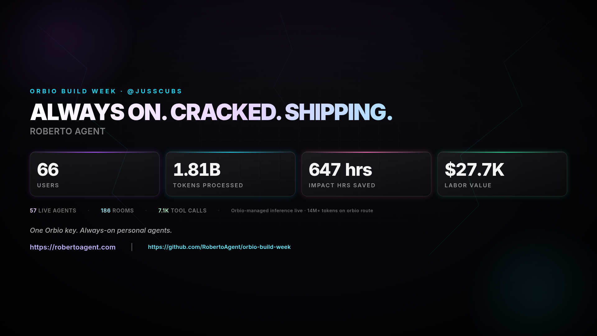

# Roberto × Orbio Build Week

**Always on personal agents that run on one Orbio key.**

> **Submission status:** Orbio Build Week · builder `@JussCubs` (approved)
> **Product:** [robertoagent.com](https://robertoagent.com)
> **Source:** closed source (disclosed to Orbio). This public repo is the **hackathon packet only**: README, write up, architecture notes, and demo assets. No product source code is included.

## The pitch

Roberto is a personal AI agent you own. It lives in shared **Rooms**, runs 24/7 on its own runtime, and does real work: browse, book, write, code, follow up. It does not hand you a todo list.

For Orbio Build Week we wired Roberto so **one Orbio key** can power that agent from first run through spend: BYOK on first run, DeepSeek Flash as the default brain on the connected key, and Orbio first managed inference with spend tracking on supported models.

That is the brief: *build an agent on your key.*

## Demo video

[](https://www.youtube.com/watch?v=QOuDSep98Rc)

**[Watch the 60.6s demo on YouTube (Unlisted)](https://www.youtube.com/watch?v=QOuDSep98Rc)**

The end card shows **live Impact stats from production** (SQL, not estimates): **66 users**, **1.81B tokens**, **647 hrs saved**, **$27.7K labor value**. Exact figures: [`assets/demo/STATS.md`](./assets/demo/STATS.md).

Channel: [https://www.youtube.com/channel/UCqvLhrwY5FILClPrAHZqU-Q](https://www.youtube.com/channel/UCqvLhrwY5FILClPrAHZqU-Q)

https://www.youtube.com/@RobertoAgent-h4c

Live product: [robertoagent.com](https://robertoagent.com). Folder notes: [`assets/demo/README.md`](./assets/demo/README.md).

## What we built (for Orbio)

**BYOK on first run**
New users can paste an Orbio API key during onboarding. The key is stored encrypted like other harness secrets.

**DeepSeek Flash default**
After an Orbio key is connected, first run auto selects **DeepSeek V4 Flash Latest (Orbio)** on that route for the welcome meeting and room brain.

**Orbio first managed inference**
Sessions run on Orbio. The user’s BYOK key when connected, otherwise Roberto managed Orbio inference on supported models.

**Spend provenance**
Managed Orbio usage is attributed per user / agent / Room (cost source on usage events) so Impact and ops can see what the key burned.

**Affiliate onboarding**
“Get a key at orbio.so” keeps friendly link text but routes through the referral URL.

**Always on runtime**
Each Roberto is a dedicated container runtime (warm pool on Hetzner). The agent stays up; Orbio is the brain meter.

Product copy presents Orbio as discounted, OpenAI compatible inference (RWA funded). This is a product shipping to users, not a weekend demo.

## Architecture (high level)

```text
                    ┌─────────────────────────────┐
                    │  Clients (web / mobile /    │
                    │  desktop / Telegram / …)    │
                    └──────────────┬──────────────┘
                                   │ Privy JWT
                    ┌──────────────▼──────────────┐
                    │  Control plane (Hono API)    │
                    │  agents · rooms · secrets   │
                    │  billing · Impact · MCP     │
                    └──────────────┬──────────────┘
                                   │
              ┌────────────────────┼────────────────────┐
              │                    │                    │
   ┌──────────▼──────────┐  ┌──────▼──────┐  ┌─────────▼─────────┐
   │  Agent runtime      │  │  Supabase   │  │  Stripe / mailer  │
   │  (OpenClaw in       │  │  Postgres   │  │                   │
   │   Hetzner pool)     │  │  + Realtime │  │                   │
   └──────────┬──────────┘  └─────────────┘  └───────────────────┘
              │
              │  OpenAI compatible
              ▼
   ┌─────────────────────┐
   │  Orbio key (BYOK)   │──── models / tools / voice / …
   │  + managed Orbio    │
   └─────────────────────┘
```

See also: [`docs/architecture.md`](./docs/architecture.md) and diagram slots under [`assets/diagrams/`](./assets/diagrams/).

## Why this fits Orbio Build Week

1. **One key, agentic app.** Roberto is not a chat wrapper. It is an always on agent with tools, Rooms, browser, and routines, pointed at Orbio.
2. **Ecosystem pull.** Onboarding features Orbio, defaults the connected key to a strong cheap model, and measures managed spend so Orbio usage is real.
3. **Engineering quality.** Parity across web, mobile, and desktop, server controlled product flags, warm pool provisioning, Impact SQL for agents, gateway repair. The agent has to stay up for the key to matter.
4. **Closed source packet.** The runtime and control plane stay private; this repo is the public submission surface judges asked for (repo + demo + write up).

## Short write up

Full one pager: [`WRITEUP.md`](./WRITEUP.md).

**For judges:** We shipped Orbio as a first class brain for Roberto: BYOK on day zero, DeepSeek Flash default on the user’s key, Orbio first managed inference with spend tracking, and an always on personal agent runtime on one Orbio key that does work in shared Rooms.

## Assets

* [`assets/demo/`](./assets/demo/) YouTube demo poster, verified stats
* [`assets/screenshots/`](./assets/screenshots/) Product UI screenshots
* [`assets/diagrams/`](./assets/diagrams/) Architecture diagram slots
* [`docs/architecture.md`](./docs/architecture.md) Longer architecture notes
* [`WRITEUP.md`](./WRITEUP.md) Short hackathon write up

## Links

* Product: [https://robertoagent.com](https://robertoagent.com)
* Orbio Build Week: [https://www.orbio.so/build](https://www.orbio.so/build)
* Builder: GitHub [`JussCubs`](https://github.com/JussCubs) · org [`RobertoAgent`](https://github.com/RobertoAgent)

## License / source notice

© Roberto Agent. Product source is **not** published here. Materials in this repository are for Orbio Build Week evaluation only unless otherwise noted.
